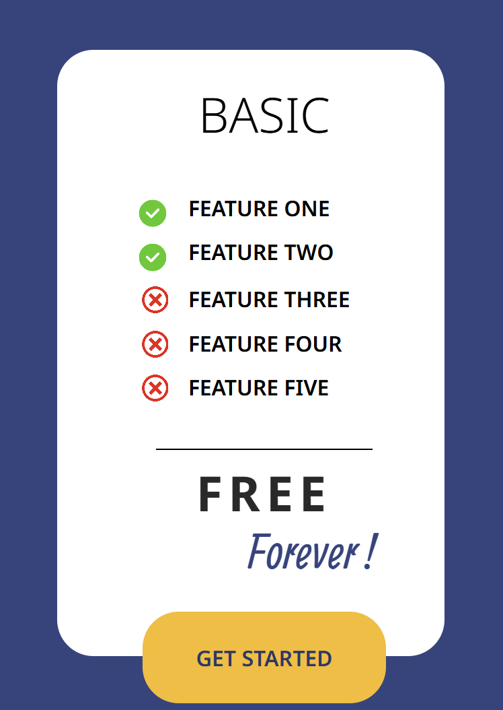

                                                      FIGMA Exercise





## Description
Ceci est le premier projet que j'ai réalisé en reproduisant un design Figma en pixel perfect. Le but de ce fichier n'est pas d'être responsive, mais d'apprendre à utiliser les outils de base du HTML et du CSS.

## Technologies utilisées
**HTML5**: Pour structurer le contenu de la page.

**CSS3**: Pour le style et l'apparence visuelle.

## Caractéristiques principales 
 Design pixel-perfect : Reproduit exactement selon la maquette Figma.

 Code propre et structuré : Axé sur la simplicité et la clarté.

 Apprentissage des bases HTML & CSS : Idéal pour débutants souhaitant comprendre les concepts fondamentaux.

##  Installation & Utilisation

1. Cloner le dépôt:
```
git clone https://github.com/BertrandM22/FigmaV1
```

2. Ouvre index.html dans ton navigateur favori pour voir le projet.
